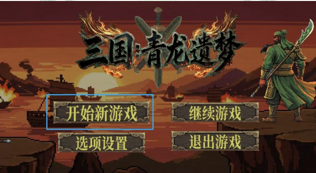
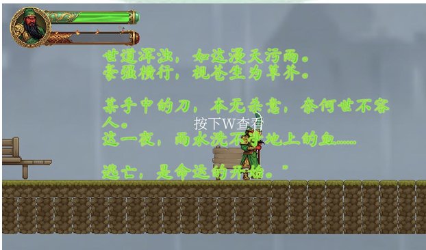

# 三国横版动作游戏

基于 **Unity 2022.3.62f2c1** + **URP** 开发的一款 2D 横版动作游戏 Demo，以三国名将 **关羽** 为主角

👉 **[点击此处下载最新 Windows 试玩版 (Demo) ](https://github.com/qzk333/First_game/releases/tag/v1.0.0)**

📺 **[点击观看 B站 游戏实机演示视频](https://www.bilibili.com/video/BV1EEraBRE2t/)**

## 游戏截图

| 主菜单 | 战斗场景 |
|-------|---------|
|  |  |

## 游戏特性

### 🎮 操作与战斗
- **移动 / 跳跃 / 二段跳** — 灵活的横向移动与空中机动
- **壁挂 / 壁跳** — 触碰墙壁时可下滑并蹬墙跳
- **冲刺 (Dash)** — 可解锁技能，水平快速突进
- **三连击** — 近战平 A 连段，最后一击击退敌人
- **空中攻击** — 跳跃中发动斩击
- **剑气远程攻击** — 可解锁技能，发射剑气波（3 倍伤害）
- **格挡反击 (Counter)** — 完美时机防御，可眩晕敌人 10 秒
- **回血 (Heal)** — 消耗 3 点怒气恢复 25% 最大生命值

### 🛡 RPG 属性系统
- **力量** — 增加攻击力 & 暴击伤害
- **敏捷** — 增加闪避率
- **体力** — 增加治疗效果
- **暴击 / 暴击伤害 / 护甲 / 闪避**
- **元素伤害**：火焰（灼烧 DOT）、冰霜（减速 20%）、闪电（降低闪避）
- **怒气系统** — 攻击命中获得怒气，消耗怒气回血

### 🤖 敌人
| 类型 | 说明 |
|------|------|
| **小兵** | 巡逻、追击、近战攻击，可被反击眩晕 |
| **弓箭手** | 远程射击，有警戒范围 |
| **Boss 1 — 于禁** | 多种技能：冲刺、瞬移、猛砸，分阶段 AI |
| **Boss 2** | 冲锋 / 猛冲攻击，可被眩晕 |
| **尖刺陷阱** | 静态机关，接触即受伤 |

### 🏗 场景交互
- **路标** — 可阅读文字提示，自动存档
- **技能解锁触发器** — 初次接触永久解锁冲刺 / 剑气
- **攻击宝箱** — 永久提升攻击力
- **陷阱** — 受伤并传送回安全位置

### 💾 存档系统
- JSON 序列化，保存至 `Application.persistentDataPath`
- 自动存档（路标、场景加载、退出游戏）
- 手动存档（暂停菜单）
- 支持继续游戏

### 🎨 UI 系统
- **主菜单**：开始游戏 / 继续游戏 / 设置（音量）/ 退出
- **暂停菜单**：继续 / 保存并继续 / 保存并退出到菜单
- **HUD**：生命值条（平滑过渡）、怒气条
- **敌人血条**：跟随镜头，颜色随血量变化
- **过场动画**：打字机风格故事介绍，可跳过
- **按键重绑定**：支持自定义按键，跨存档持久化

### 📖 剧情
- 三国背景，主角 **关羽**
- 打败于禁后触发分支剧情：选择防守荆州（好结局）或继续追击（坏结局）
- 两种结局各有独立画面

## 如何运行

### 🎮 玩家试玩 (直接玩)
如果你只是想体验游戏，无需下载庞大的引擎和源码：
1. 前往本项目的 **[Releases 页面](https://github.com/qzk333/First_game/releases/tag/v1.0.0)**。
2. 下载最新的 `.zip` 压缩包。
3. 解压到电脑的任意全英文路径文件夹中。
4. 双击运行里面的 `.exe` 游戏程序即可开始游玩。
*(注：由于是个人独立开发未签名，若 Windows 提示拦截，请点击“更多信息 -> 仍要运行”)*

### 环境要求
- **Unity Hub** + **Unity Editor 2022.3.62f2c1**（或任意 2022.3 LTS 版本）

### 启动步骤
1. 打开 Unity Hub → **Open** → 选择项目目录 `D:\桌面\First_game`
2. 在 Project 窗口中打开 `Assets/Scenes/Menu.unity`
3. 点击 **Play** 按钮运行

### 构建发布
1. **File → Build Settings**
2. 确保场景顺序：`Menu(0)` → `SampleScene1(1)` → `SampleScene(2)`
3. 点击 **Build**，选择输出目录
4. 支持平台：Windows / macOS / Linux

## 项目结构

```
Assets/
├── Scenes/          # 游戏场景
│   ├── Menu.unity         # 主菜单
│   ├── SampleScene1.unity # 第一关（含 Boss1 于禁）
│   └── SampleScene.unity  # 后续关卡（含 Boss2）
├── Script/          # 全部 C# 脚本
│   ├── Entity.cs          # 实体基类
│   ├── EntityFX.cs        # 视觉特效
│   ├── Player/            # 玩家状态机（12+ 种状态）
│   ├── Enemy/             # 敌人 AI（小兵/弓箭手/Boss 1/Boss 2/尖刺）
│   ├── Stat/              # RPG 属性系统
│   ├── Manager/           # 输入 / 音频 / 玩家管理器
│   ├── UI/                # 全部 UI 脚本
│   ├── Save and Load/     # 存档系统
│   ├── Environment/       # 场景交互（路标/宝箱/陷阱）
│   └── Gameplay/          # 剧情流程控制
├── Animations/      # 动画控制器 & 动画片段
├── Graphics/        # 精灵图 & 纹理
├── Audio/           # 音效 & 背景音乐
├── Prefabs/         # 预制体
└── Cainos/          # 第三方像素艺术资源
```

## 技术栈

| 组件 | 方案 |
|------|------|
| 引擎 | Unity 2022.3 LTS |
| 渲染管线 | Universal Render Pipeline (URP) |
| 输入系统 | Unity Input System（支持按键重绑定） |
| UI | uGUI + TextMeshPro |
| 动画 | Unity Animator（状态机） |
| 物理 | Physics2D (Rigidbody2D, Collider2D) |
| 序列化 | JSON (JsonUtility) |
| 开发语言 | C# |

## 第三方资源

- [Cainos Pixel Art Platformer - Village Props](https://assetstore.unity.com/packages/2d/environments/pixel-art-platformer-village-props-165670) — 像素艺术场景素材
- Yughues Free Pavements Materials — 地面材质
- Unity Input System Rebinding UI Sample — 按键重绑定 UI 示例

## 许可

本项目为个人学习 Demo，资源素材版权归各自原作者所有，素材大部分由gemini生成+ps润色，作为作者的首个demo，项目有待完善，欢迎大家指导。
